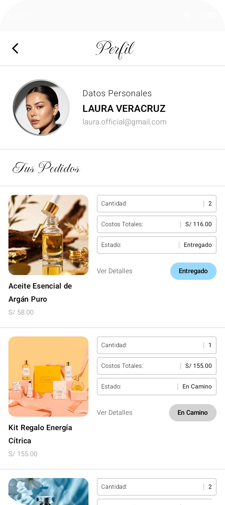
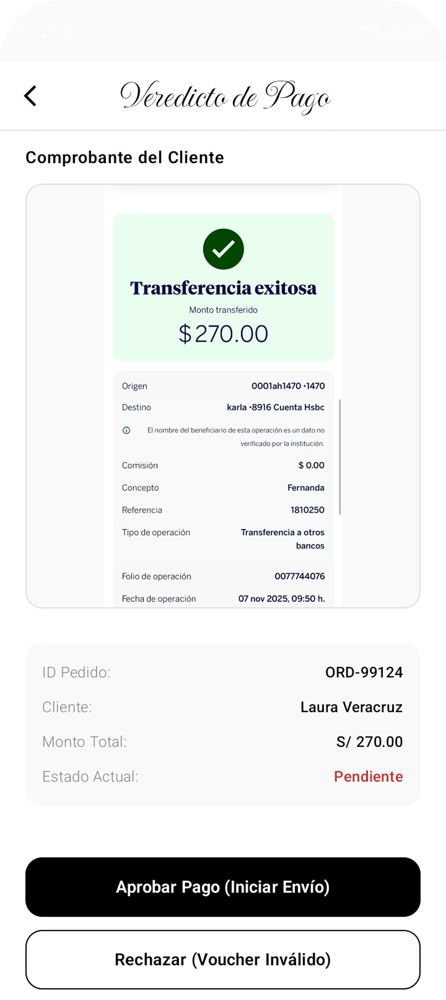
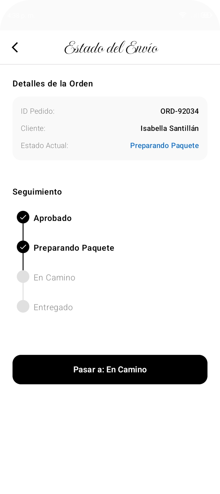
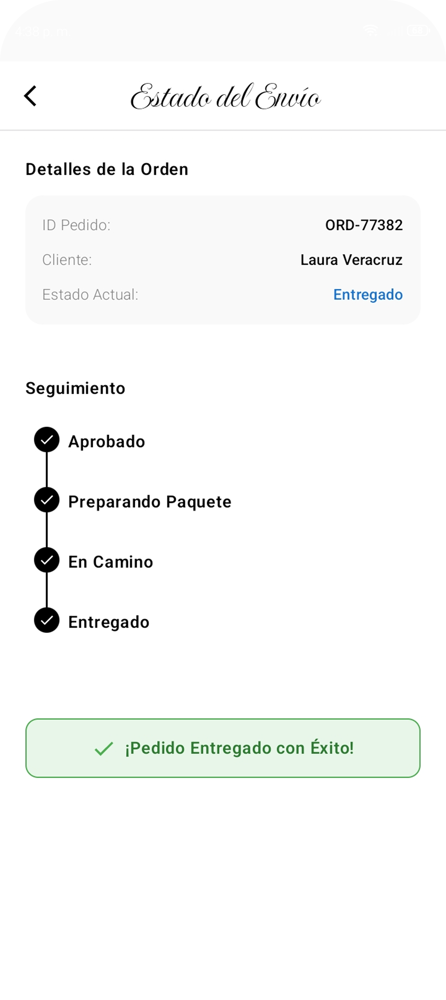
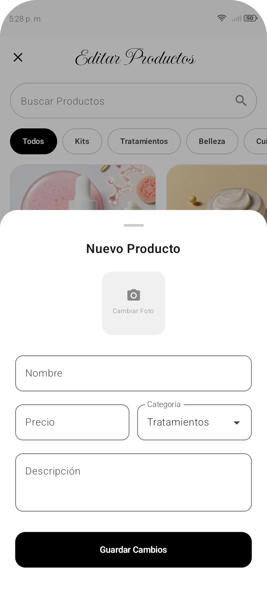
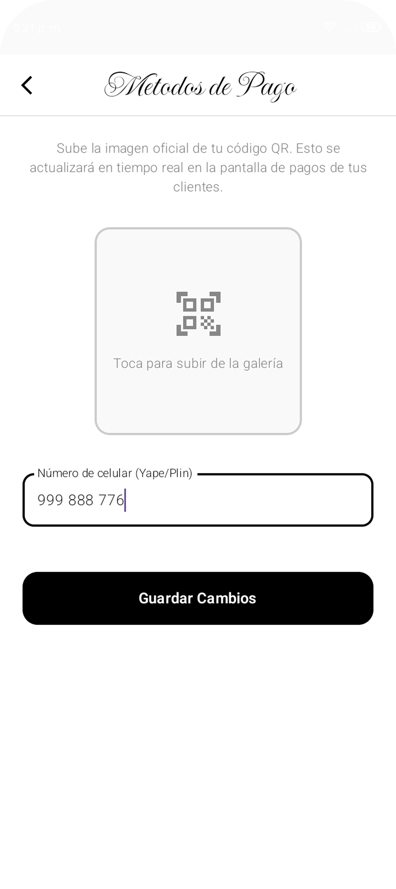
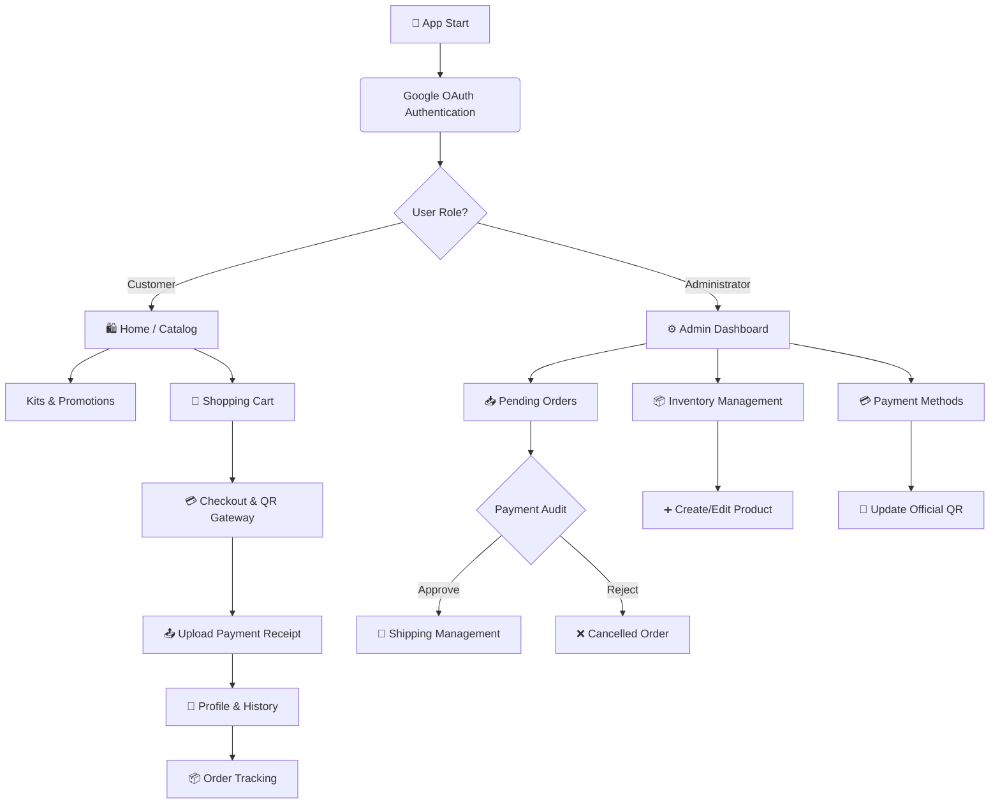

<div align="center">
  

  <h1>E-Commerce KMP | Enterprise-Grade Retail Architecture</h1>
  <h3>Remedioz Natura Showcase</h3>

  <p><strong>High-Performance Multiplatform E-Commerce Architecture, Declarative UI, and Offline Availability.</strong></p>

[](https://kotlinlang.org)
[](https://www.jetbrains.com/lp/compose-multiplatform/)
[]()
[]()
[]()
</div>

---

## 1. Project Vision and Repository Nature

After a successful architectural design cycle with production-level foundations, this codebase has been surgically structured to act as an elite **Frontend & Architecture Showcase**.

**E-Commerce KMP** is not a generic virtual store. It establishes a "competitive moat" in multiplatform development by demonstrating that transactional complexity (B2C) and backoffice management (B2B) can coexist in a single codebase without sacrificing performance. By isolating the data layer into a purely reactive in-memory database, the project allows for immediate **Plug-and-Play** compilation. Any developer, auditor, or Tech Lead can instantly clone and evaluate the system without dealing with API keys or server configurations.

---

## 2. Tech Stack and Technical Excellence (Infrastructure)

The project is governed by the *"Write once, run natively anywhere"* paradigm, optimized for scenarios with high visual load and strict transactional logic.

* **Core & UI Framework:** Kotlin Multiplatform (KMP) and Compose Multiplatform. Shares 100% of the visual and business logic between Android and iOS.
* **Extreme Performance (iOS):** Rendering unlocked at **120Hz (ProMotion)** by injecting the `CADisableMinimumFrameDurationOnPhone` parameter in the Apple ecosystem, ensuring silky smooth animations.
* **State Management (UDF):** Rigorous implementation of *Unidirectional Data Flow* using `StateFlow` and Coroutines, eradicating race conditions in the shopping cart.
* **Build Infrastructure:** Centralized `.toml` configuration files, Gradle memory optimization (`-Xmx3072M`), and strict exclusion of compromised artifacts (`.jks`, `Pods/`) via a bulletproof `.gitignore`.
* **Automated CI/CD:** Continuous Integration pipeline implemented in GitHub Actions. Every *commit* triggers a `macos-latest` virtual machine that verifies the Kotlin code and compiles the native iOS schema using `xcodebuild`, ensuring zero regressions in production.

---

## 3. Case Study: User Ecosystem (B2C Consumer App)

The design reflects a hyper-localized e-commerce, merging the warmth of traditional botanical commerce with the non-negotiable fluidity of modern mobile applications.

### Authentication and Discovery
The flow starts with a frictionless, simplified Onboarding (*Google OAuth*). The main screen features a dynamic catalog and an advanced `HorizontalPager` for the Promotional Kits section, managing the scroll state without dropping *frames*.

<p align="center">
  
  &nbsp;&nbsp;&nbsp;
  
  &nbsp;&nbsp;&nbsp;
  
</p>

### Transaction and Localized Checkout
Cart management with dynamic unit control and exact mathematical calculations in real-time. The *Checkout* simulates the financial idiosyncrasy of the Latin American market, implementing a transfer gateway using QR codes and payment receipt (Voucher) validation.

<p align="center">
  
  &nbsp;&nbsp;&nbsp;
  
  &nbsp;&nbsp;&nbsp;
  
</p>

---

## 4. Case Study: Backoffice and CMS (B2B Admin Mode)

A pocket-sized ERP designed for comprehensive store management, demonstrating complex role handling, conditional routing, and reactive database mutation in Compose.

### Control Tower and Financial Auditing
The main panel grants access to the pending orders inbox. The system includes strict logic for the administrator to visually validate customer payment receipts and make business decisions (Approve/Reject) before releasing inventory.

<p align="center">
  
  &nbsp;&nbsp;&nbsp;
  
  &nbsp;&nbsp;&nbsp;
  
</p>

### Logistics and State Machine (Order Tracking)
Implementation of a custom *Stepper UI* component for package telemetry. The administrator updates mutable states (*Preparing -> On the Way -> Delivered*), which are instantly propagated to the customer's screen thanks to the reactive *Flows*-based architecture.

<p align="center">
  
  &nbsp;&nbsp;&nbsp;
  
  &nbsp;&nbsp;&nbsp;
  
</p>

### Integrated Content Management System (CMS)
The Administrator does not rely on technical teams to maintain the platform. It features a complete CRUD system to edit the product catalog, modify prices, and dynamically update the credentials and payment QR code seen by customers.

<p align="center">
  
  &nbsp;&nbsp;&nbsp;
  
  &nbsp;&nbsp;&nbsp;
  
</p>

---

## 5. Software Architecture (Project Map)

The following diagram illustrates the routing and business logic implemented in the application:



---

## 5. Software Architecture (Project Map)

The code follows a **Clean Architecture** approach structured by features (*Feature-Based*), ensuring a strict separation of concerns:

* `domain`: The pure, immutable core. Contains data models ("Product", "Order") and repository interfaces. Completely agnostic: it is entirely unaware of Android, iOS, or Compose.
* `data`: The infrastructure layer. Controlled implementations (e.g., `MockProductRepositoryImpl`) that inject static data with simulated latency (`delay()`) to verify UI loading states. Native resource resolution using the `expect/actual` pattern.
* `presentation`: The visual layer, surgically divided into business modules (`home`, `admin`, `checkout`), global themes, and injectable state managers like `CartManager`.

### Repository Golden Rules
* **Domain Isolation:** Importing UI states (`MutableState`) into underlying layers is strictly prohibited.
* **DRY Principle in UI:** Components such as `ProductCard`, status buttons, and `TopNavBar` are generic entities reused systematically throughout the application.
* **Passive UI:** `@Composable` functions are limited to rendering states and emitting *Intents*. Logic resides strictly within the *ViewModels*.

---

## 6. Build Instructions

### Prerequisites
* **Android:** Android Studio Ladybug (or higher) with the KMP plugin enabled.
* **iOS:** macOS machine with Xcode 16+ installed.

### Local Deployment
1. Clone the repository:
   ```bash
   git clone https://github.com/JastinBolanos/E-Commerce-KMP.git
   cd e-commerce-kmp
   ```

2. **For Android:** Open the project in Android Studio, select the `composeApp` configuration, and press *Run*.
3. **For iOS:**
   * Open the `iosApp` folder in Xcode.
   * Wait for *Swift* and *Assets* indexing to complete.
   * Select a simulator (e.g., iPhone 15/16) and press `Cmd + R`. Xcode will automatically delegate the compilation of the Kotlin framework to Gradle.

---

## 7 License and Intellectual Property

This repository and all its contents are protected under a **Proprietary Restricted-Use License**.

* The source code is made public strictly for purposes of **study, learning, academic review, and technical evaluation**.
* Plagiarism of the visual structure (box arrangement, programmatic gradients, color palettes, and layouts) is **strictly prohibited**, as is the extraction, distribution, unauthorized commercial use, or republication (in whole or in part) on third-party platforms.
* To review the full legal terms, usage restrictions, and commercial conditions, please read the [LICENSE](./LICENSE) file carefully.
* For detailed information regarding authorship and attribution of third-party graphic resources (3D renders and visual elements legitimately obtained from the Figma community), please consult the legal statement [ASSETS_LICENSE](./ASSETS_LICENSE.md).
