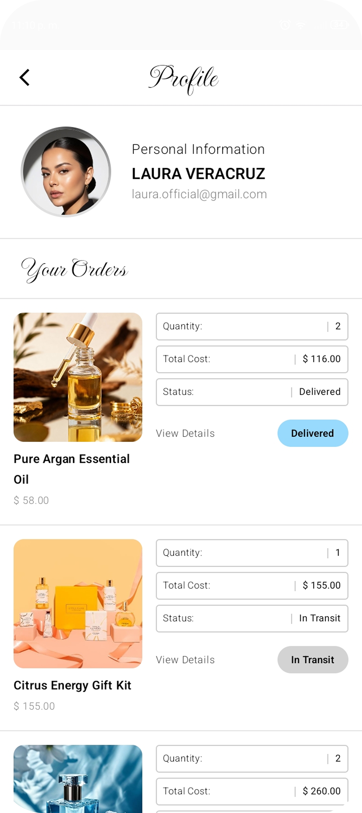
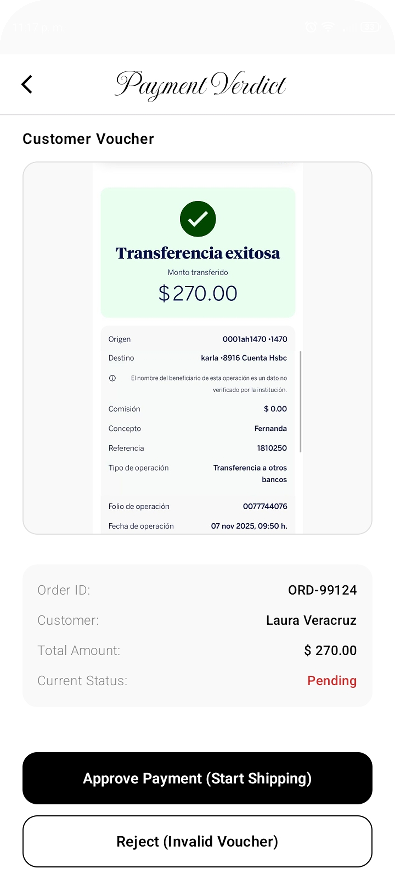
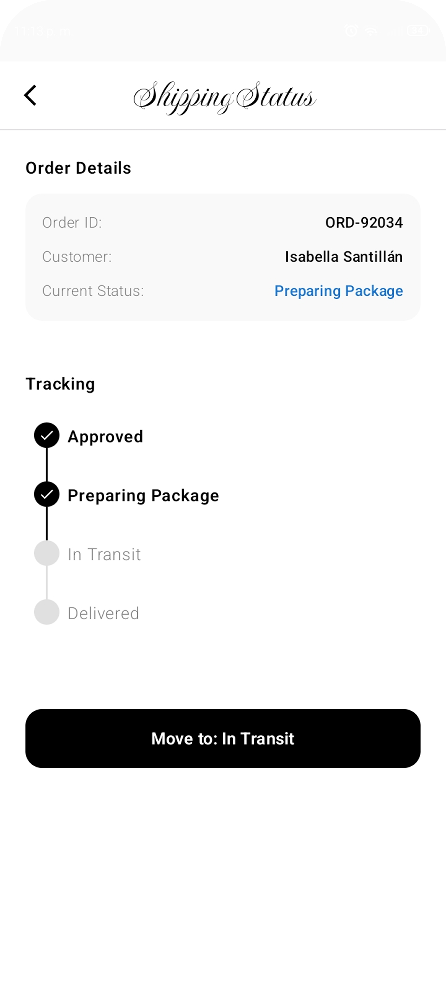
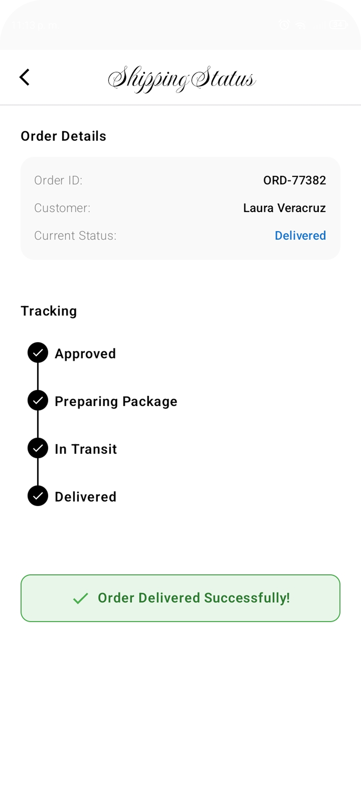
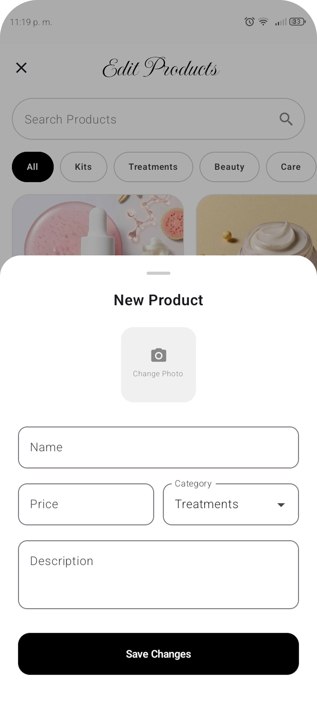
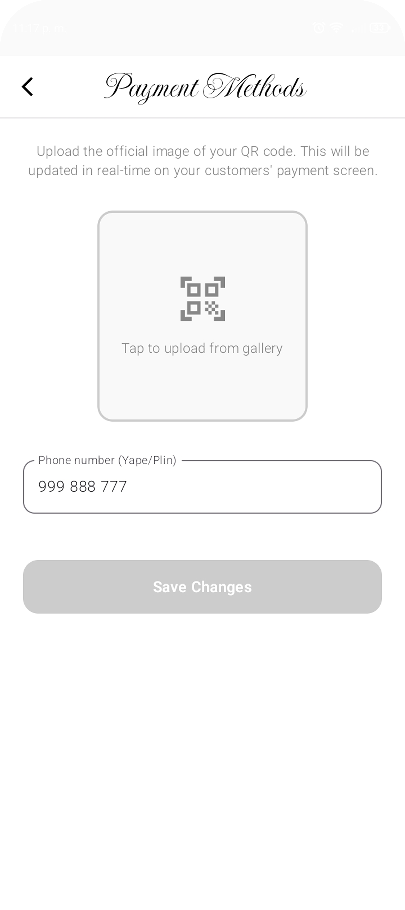
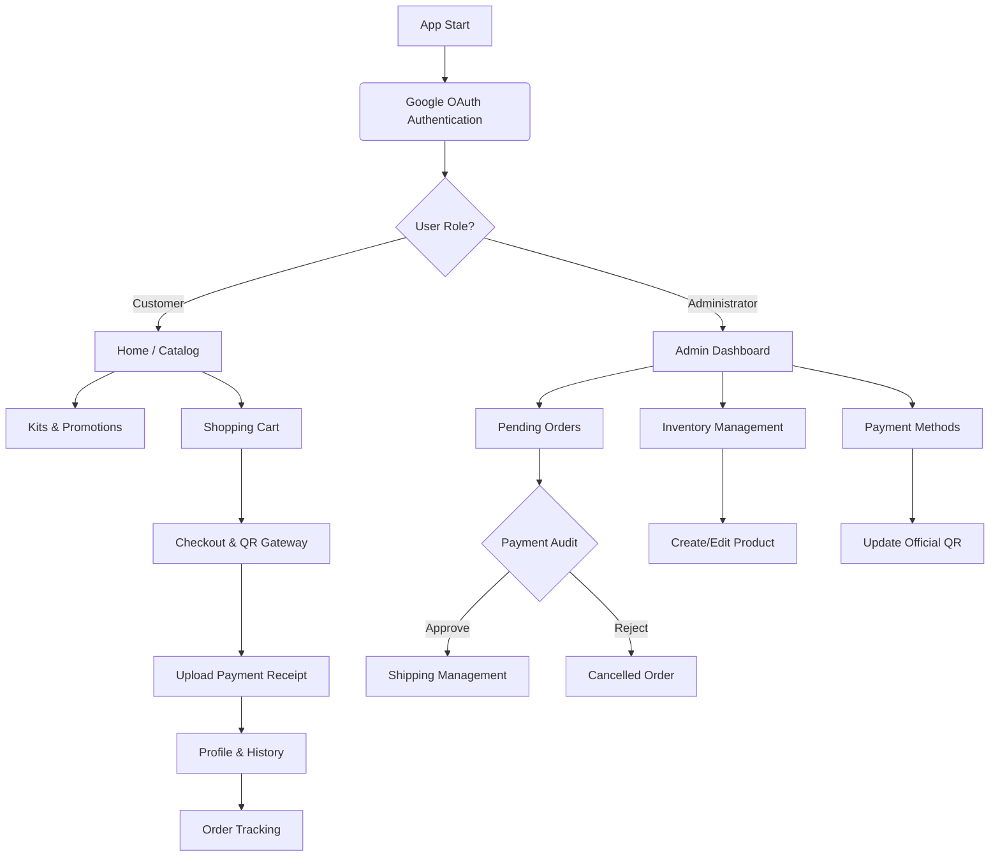

<div align="center">
  

  <h1>E-Commerce KMP | Retail Client Architecture</h1>
  <h3>Remedioz Natura Showcase</h3>

  <p><strong>A multiplatform retail frontend application exploring declarative UI patterns, client-side state management, and offline-first workflows across native Android, iOS, and Web.</strong></p>

[](https://kotlinlang.org)
[](https://www.jetbrains.com/lp/compose-multiplatform/)
[]()
[]()
[]()
[]()

<p align="center">
  <a href="https://github.com/JastinBolanos/E-Commerce-KMP/releases/download/v2.0.0/E-CommerceKMP.apk">
    
  </a>
</p>
</div>

---

## 1. Project Vision and Scope

This repository serves as an open **Frontend & Client Architecture Showcase**, designed to explore modern multiplatform UI paradigms and clean component structuring for retail applications.

**E-Commerce KMP** demonstrates how consumer shopping experiences (B2C) and administrative interfaces (B2B) can be organized within a single, unified client-side codebase using Kotlin Multiplatform. The application utilizes a reactive local data store with simulated latency, enabling an immediate **plug-and-play** evaluation experience. Developers, designers, and engineering teams can clone, build, and explore the complete UI and interaction flows locally without configuring external backend services or managing API credentials.

---

## 2. Tech Stack and Technical Foundations

The project leverages modern multiplatform tooling to share UI components and presentation logic across supported form factors while preserving platform-native feel.

* **Core & UI Framework:** Kotlin Multiplatform (KMP) and Compose Multiplatform. Delivers a native Android experience today, driven by a shared declarative UI and business logic engine structured to extend to iOS and **Web**.
* **WebAssembly Integration (Wasm):** The client architecture is organized to support browser targets using WebAssembly (Kotlin 2.x), rendering via HTML5 Canvas with responsive window scaling (`object-fit: contain`) and anti-aliased visual output.
* **State Management (UDF):** Built around *Unidirectional Data Flow* using Kotlin `StateFlow` and Coroutines, providing predictable state transitions across cart interactions, order updates, and navigation.
* **Build Infrastructure:** Managed through modern Gradle version catalogs (`libs.versions.toml`), dedicated heap memory configurations (`-Xmx3072M`), and standard project hygiene rules (`.gitignore`).
* **Continuous Integration:** Automated build workflows configured via GitHub Actions. Each commit runs on a macOS virtual environment, validating the Kotlin code and testing iOS compilation with `xcodebuild` to maintain cross-platform build consistency.

---
###  Live Demo: E-Commerce KMP in Action
> Explore the showcased experience: observe the interface's fluidity, visual consistency, and the integrated operation of the key user-facing modules. This brief demonstration presents Remedioz Natura, an enterprise-grade retail architecture delivering a native Android experience driven by a powerful shared Kotlin Multiplatform engine. To access the full experience—including all B2C flows and B2B administrative modules—download the APK available at the top of this README file.

https://github.com/user-attachments/assets/89751b45-21f7-4c6f-997e-7cb8b099ee5f

---

## 3. Case Study: User Ecosystem (B2C Consumer App)

The client interface is tailored around a localized retail concept, combining warm botanical visual themes with responsive mobile UI patterns.

### Authentication and Discovery
The consumer journey begins with an onboarding flow supporting Google OAuth authentication. The main catalog features structured product listings, detailed product views, and an animated `HorizontalPager` carousel for promotional kits designed to preserve smooth scrolling states.

<p align="center">
  
  &nbsp;&nbsp;&nbsp;
  
</p>

<p align="center">
  
  &nbsp;&nbsp;&nbsp;
  
</p>

### Transaction and Localized Checkout
Cart management includes dynamic unit counters and immediate total recalculations. The checkout screen simulates familiar regional payment workflows, featuring bank transfer instructions via QR code and a receipt (voucher) upload confirmation step.

<p align="center">
  
  &nbsp;&nbsp;&nbsp;
  
  &nbsp;&nbsp;&nbsp;
  
</p>

---

## 4. Case Study: Backoffice and CMS (B2B Admin Mode)

A compact client-side management interface designed to showcase role-based UI states, conditional navigation, and reactive data handling within Compose.

### Order Overview and Receipt Verification
The administrative dashboard provides direct access to the pending orders queue. Reviewers can examine customer-uploaded payment receipts directly inside the UI to approve or decline orders before simulated fulfillment begins.

<p align="center">
  
  &nbsp;&nbsp;&nbsp;
  
  &nbsp;&nbsp;&nbsp;
  
</p>

### Logistics and Status Updates (Order Tracking)
Features a custom stepper component tracking the order delivery lifecycle (*Preparing -> On the Way -> Delivered*). Status updates made in the admin view propagate reactively across screens via shared Kotlin Flows.

<p align="center">
  
  &nbsp;&nbsp;&nbsp;
  
  &nbsp;&nbsp;&nbsp;
  
</p>

### Content Management (Catalog & Payment Setup)
The administrative tools allow store operators to maintain catalog data locally. This section includes forms to create or edit products, adjust prices, and update the QR payment code displayed during customer checkout.

<p align="center">
  
  &nbsp;&nbsp;&nbsp;
  
  &nbsp;&nbsp;&nbsp;
  
</p>

---

## 5. Software Architecture (Project Map)

The following diagram illustrates the routing and business logic implemented in the application:


```mermaid
graph TD
    A[ App Start] --> B(Google OAuth Authentication)
    B --> C{User Role?}
    
    %% Customer Flow (B2C)
    C -->|Customer| D[ Home / Catalog]
    D --> E[Kits & Promotions]
    D --> F[ Shopping Cart]
    F --> G[ Checkout & QR Gateway]
    G --> H[ Upload Payment Receipt]
    H --> I[ Profile & History]
    I --> J[ Order Tracking]
    
    %% Admin Flow (B2B)
    C -->|Administrator| K[ Admin Dashboard]
    K --> L[ Pending Orders]
    L --> M{Payment Audit}
    M -->|Approve| N[ Shipping Management]
    M -->|Reject| O[ Cancelled Order]
    
    K --> P[ Inventory Management]
    P --> Q[ Create/Edit Product]
    
    K --> R[ Payment Methods]
    R --> S[ Update Official QR]
```

---

## 6. Clean Architecture & Engineering Principles

The codebase applies **Clean Architecture** conventions organized by feature, maintaining clear boundaries across layers:

* `domain`: The core business layer. Contains pure data models (`Product`, `Order`) and repository contracts, completely decoupled from platform SDKs and UI frameworks.
* `data`: The client data infrastructure. Houses repository implementations (e.g., `MockProductRepositoryImpl`) with local mock data and artificial delays (`delay()`) to test loading indicators and error states. Platform-specific resources are handled through the `expect/actual` pattern.
* `presentation`: The user interface layer, modularized by feature (`home`, `admin`, `checkout`), encompassing shared design tokens, themes, and scoped state containers such as `CartManager`.

### Architecture Guidelines
* **Domain Independence:** Domain models and interfaces remain agnostic of Compose UI state objects (`MutableState`).
* **Reusable UI Components:** Common components such as `ProductCard`, status buttons, and `TopNavBar` are organized as modular units reused throughout the app.
* **Passive UI Pattern:** `@Composable` functions focus on state rendering and user intent emission, keeping state transformation logic inside corresponding *ViewModels*.

---

## 7. Build Instructions

### Prerequisites
* **Android:** Android Studio Ladybug (or higher) with the Kotlin Multiplatform plugin enabled.
* **iOS:** macOS machine with Xcode 16+ installed.
* **Web:** Any modern browser with WebAssembly support (Chrome, Firefox, Safari, Edge).

### Local Deployment
1. Clone the repository:
   ```bash
   git clone https://github.com/JastinBolanos/E-Commerce-KMP.git
   cd e-commerce-kmp
   ```

2. **For Android:** Open the project in Android Studio, select the `composeApp` configuration, and press *Run*.
3. **For WebAssembly (Browser):** In Android Studio, open the Gradle panel -> `composeApp` -> `Tasks` -> `kotlin browser` -> double click on `wasmJsBrowserDevelopmentRun`. The application will compile and automatically launch in your default web browser.
4. **For iOS:**
   * Open the `iosApp` folder in Xcode.
   * Wait for *Swift* and *Assets* indexing to complete.
   * Select a simulator (e.g., iPhone 15/16) and press `Cmd + R`. Xcode will automatically delegate the compilation of the Kotlin framework to Gradle.

---

## 8. License and Intellectual Property

This repository and all its contents are protected under a **Proprietary Restricted-Use License**.

* The source code is made public strictly for purposes of **study, learning, academic review, and technical evaluation**.
* Plagiarism of the visual structure (box arrangement, programmatic gradients, color palettes, and layouts) is **strictly prohibited**, as is the extraction, distribution, unauthorized commercial use, or republication (in whole or in part) on third-party platforms.
* To review the full legal terms, usage restrictions, and commercial conditions, please read the [LICENSE](./LICENSE) file carefully.
* For detailed information regarding authorship and attribution of third-party graphic resources (3D renders and visual elements legitimately obtained from the Figma community), please consult the legal statement [ASSETS_LICENSE](./ASSETS_LICENSE.md).
