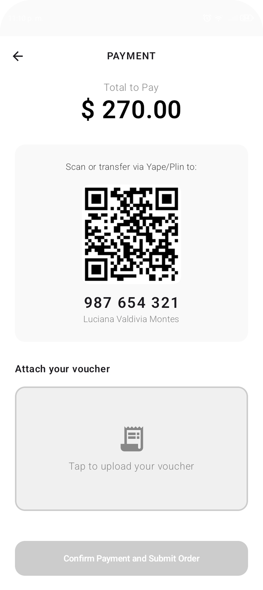

<div align="center">
  

  <h1>E-Commerce KMP</h1>
  <p><strong>Multiplatform Retail Client Architecture (B2C & B2B)</strong></p>

[](https://kotlinlang.org)
[](https://www.jetbrains.com/lp/compose-multiplatform/)
[]()
[]()
[]()

<p align="center">
  <a href="https://github.com/JastinBolanos/E-Commerce-KMP/releases/download/v2.0.0/E-CommerceKMP.apk">
    
  </a>
</p>
</div>

---

## Overview

**E-Commerce KMP** is an open architecture showcase demonstrating how consumer shopping experiences (B2C) and administrative interfaces (B2B) can coexist in a single, unified codebase using **Kotlin Multiplatform** and **Compose Multiplatform**.

---

## App Preview

### 🛒 B2C: Consumer Ecosystem
> Localized retail experience with dynamic carts and QR payment workflows.

| Catalog & Discovery | Cart Management | QR Checkout |
| :---: | :---: | :---: |
|  |  |  |

### 🛠️ B2B: Backoffice & Admin Mode
> Client-side management interface for order auditing and inventory control.

| Admin Dashboard | Pending Orders | Inventory Management |
| :---: | :---: | :---: |
|  |  |  |

---

## Technical Foundations

* **Core & UI:** Compose Multiplatform targeting Android (Native), iOS, and WebAssembly (Wasm via HTML5 Canvas).
* **Architecture:** Clean Architecture + Unidirectional Data Flow (UDF). Strict separation between `domain`, `data`, and `presentation` layers.
* **State Management:** Reactive states driven by Kotlin `StateFlow` and Coroutines.
* **Infrastructure:** Gradle Version Catalogs (`libs.versions.toml`) and automated CI/CD pipelines via GitHub Actions (macOS runner for `xcodebuild` validation).

---

## Routing & Logic Map

| User Role | Main Navigation Flow |
| :--- | :--- |
| **🛍️ Customer (B2C)** | Catalog ➔ Shopping Cart ➔ QR Checkout ➔ Order Tracking |
| **🛡️ Admin (B2B)** | Dashboard ➔ Pending Orders ➔ Payment Audit ➔ Shipping |
| **📦 Admin (CMS)** | Dashboard ➔ Inventory & Product Management |

---

## Getting Started

1. Clone the repository:
   ```bash
   git clone [https://github.com/JastinBolanos/E-Commerce-KMP.git](https://github.com/JastinBolanos/E-Commerce-KMP.git)
   cd E-Commerce-KMP
